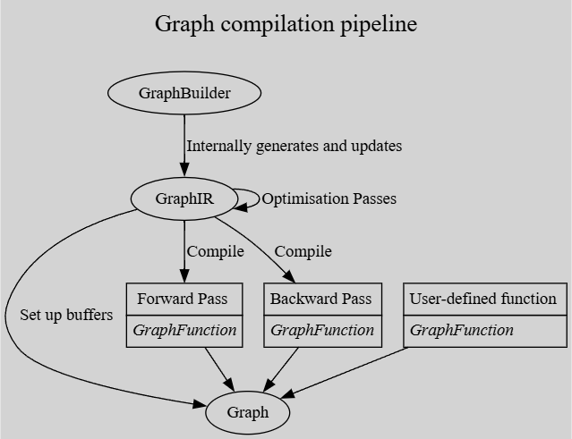
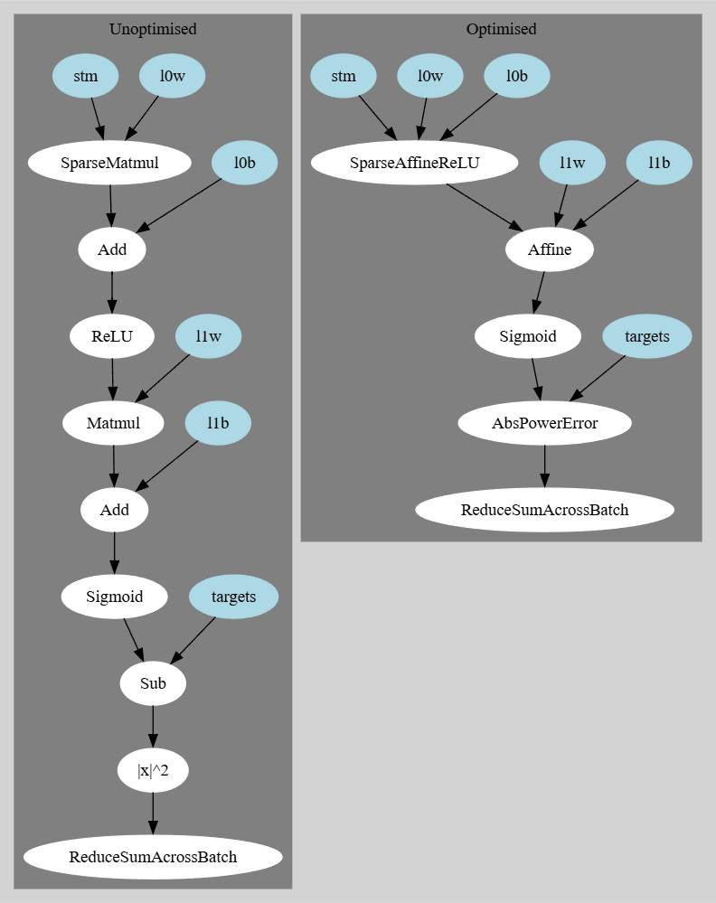

# Graph Architecture

A brief overview of the architecture in `bullet_core` for creating `Graph`s is as follows:



We look at the following simple example to make this clearer:

```rust
use bullet_core::{
    cpu::{CpuError, CpuThread},
    graph::builder::{GraphBuilder, Shape},
};

fn main() -> Result<(), CpuError> {
    let builder = GraphBuilder::default();
    builder.dump_graphviz("a.txt");

    // inputs
    let inputs = builder.new_sparse_input("inputs", Shape::new(768, 1), 32);
    let targets = builder.new_dense_input("targets", Shape::new(1, 1));

    // trainable weights
    let l0 = builder.new_affine("l0", 768, 256);
    let l1 = builder.new_affine("l1", 256, 1);

    // inference
    let hl = l0.forward(inputs).relu();
    let out = l1.forward(hl).sigmoid();
    let _loss = (out - targets).abs_pow(2.0);

    // build graph
    let graph = builder.build(CpuThread);

    println!("Forward Pass Code");
    graph.display_function_code("forward").unwrap();

    println!();

    println!("Backward Pass Code");
    graph.display_function_code("backward").unwrap();

    graph.get_last_device_error()
}
```



```
Forward Pass Code
MaybeUpdateBatchSize { ... }
SparseAffineActivateStrided { ... }
MaybeUpdateBatchSize { ... }
Matmul { ... }
LinearCombinationSplat { ... }
MaybeUpdateBatchSize { ... }
Unary { op: DiffableFromOutput(Sigmoid), ... }
MaybeUpdateBatchSize { ... }
AbsPowerError { ... }
ReduceAcrossBatch { ... }
```

```
Backward Pass Code
Set(...)
MaybeUpdateBatchSize { ... }
SplatAcrossBatch { ... }
MaybeUpdateBatchSize { ... }
AbsPowerErrorBackward { ... }
MaybeUpdateBatchSize { ... }
UnaryBackward { ... }
MaybeUpdateBatchSize { ... }
Matmul { ... }
MaybeUpdateBatchSize { ... }
Matmul { ... }
MaybeUpdateBatchSize { ... }
ReduceAcrossBatch { ... }
BackpropSparseAffineActivateStrided { ... }
```