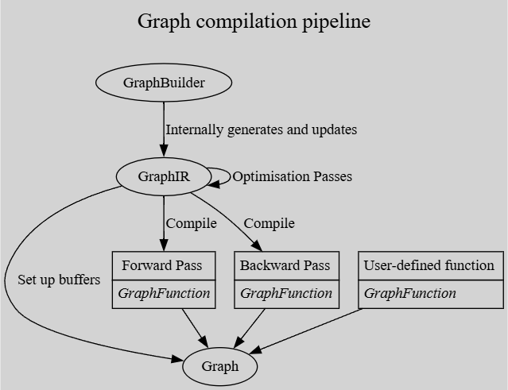
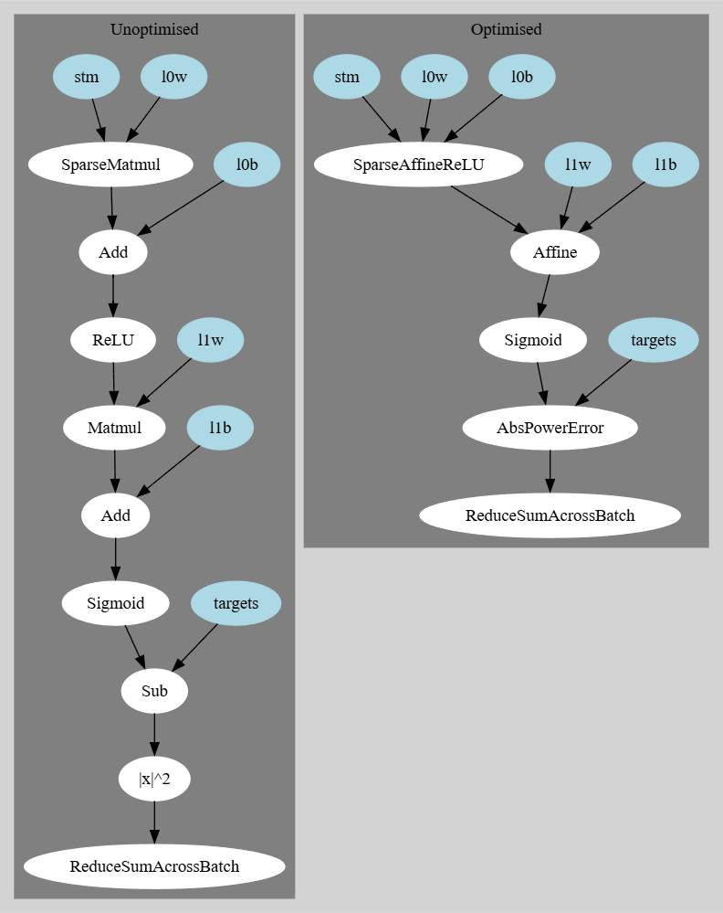

# Graph Compilation Internals

## Graph Compilation Overview



## Example

### Code

We look at the following example code:

```rust
use bullet_core::{
    cpu::{CpuError, CpuThread},
    graph::builder::{GraphBuilder, Shape},
};

fn main() -> Result<(), CpuError> {
    let builder = GraphBuilder::default();
    builder.dump_graphviz("a.txt");

    // inputs
    let inputs = builder.new_sparse_input("inputs", Shape::new(768, 1), 32);
    let targets = builder.new_dense_input("targets", Shape::new(1, 1));

    // trainable weights
    let l0 = builder.new_affine("l0", 768, 256);
    let l1 = builder.new_affine("l1", 256, 1);

    // inference
    let hl = l0.forward(inputs).relu();
    let out = l1.forward(hl).sigmoid();
    let _loss = (out - targets).abs_pow(2.0);

    // build graph
    let graph = builder.build(CpuThread);

    println!("Forward Pass Code");
    graph.display_function_code("forward").unwrap();

    graph.get_last_device_error()
}
```

Using `GraphBuilder` is intended to be reasonably ergonomic, with the underlying `GraphIR` being constructed on the fly.
Each node in the `GraphIR` has several important attributes that needs to be tracked, most notably:
- Layout
- Requires gradient?
- Batched?

The attributes are resolved based on how the node is created, for example the line
```rust
let inputs = builder.new_sparse_input("inputs", Shape::new(768, 1), 32);
```
creates a node with sparse layout (and nnz = 32), that does not require gradient (as it is an input),
and is batched. The other input is the same but with a dense layout.

Internally, the line representing a `768 -> 256` affine transformation
```rust
let l0 = builder.new_affine("l0", 768, 256);
```
creates two nodes, `l0w` and `l0b` with the appropriate shapes `256 x 768` and `256 x 1` respectively,
which are dense, require gradients and are not batched. These nodes are stored in the retured `Affine`
struct from which they can be accessed with `l0.weights` and `l0.bias` respectively.

In inference, the line
```rust
let hl = l0.forward(inputs).relu();
```
performs the following
```rust
let intermediate1 = l0.weights.matmul(inputs);
let intermediate2 = intermediate1 + l0.bias;
let hl = intermediate2.relu();
```
hence creating 3 new nodes, each having dense layout, requiring gradients (as the `l0.weights` and `l0.bias` require gradients),
and are batched (as the `inputs`) are batched.

The rest of the inference is similar, however you can see that the final result
```rust
let _loss = (out - targets).abs_pow(2.0);
```
is unused. This is because the `GraphIR` knows that this is the final node already, so the resulting returned node does not need to be used anywhere.
An astute viewer may work through this and realise that though this final `_loss` is a scalar (`1 x 1`), it is batched when we require an unbatched scalar loss (i.e. a single scalar value) to differentiate. When the `Graph` is built, the `GraphIR` is checked, firstly assuring that the final node shape is in fact a scalar, but if it is batched then it implicitly inserts an additional operation `ReduceSumAcrossBatch`.

### GraphIR

The generated `GraphIR` (Graph Intermediate Representation) is shown as it is first constructed ("Unoptimised"), and then after optimisations have been run.
The `GraphIR` is a static-single-assignment (SSA) representation and hence can be visualised as a directed acyclic graph (DAG).



### Compiled Graph

For each node in the `GraphIR`, the resulting graph contains one or more buffers for it:
- The `Values`, that get populated during the forward pass
- The `Gradients` if needed, that get populated during the backward pass
- Any number of additional "ancillary" buffers, depending on how the node was created, e.g. some operations may require intermediate results to be stored for efficiency reasons

The `GraphIR` is then used to define forwards and backwards pass functions based on each operation, as well as a function to zero the gradients of nodes for which gradients are tracked. These `GraphFunctions` are simply a sequence of `GraphInstruction`s that perform a specific operation on given buffers in the `Graph`, e.g.
```rust
Set { id: NodeId::new(5, NodeIdTy::Values), val: 0.0 }
```
sets the buffer of values associated with the 5th node to all zeros.
A user may also define additional custom functions to run on the graph.

### Forward Pass Code

You can see that for the forward pass, there is almost a one-to-one correspondence between the nodes in the GraphIR,
and the operations run for the function - with two notable exceptions:
- `MaybeUpdateBatchSize` for each non-leaf node in the graph, which handles reallocating buffers in the `Graph` if needed
    - Reallocations only occur when running the function for a batch size that is larger than has been used before (if smaller then simply only a portion of the allocated buffer is used)
    - Other graph instructions should thus simply check that batch sizes match, as all resizing should be handled through this instruction
- The `Affine` operation is broken down into `Matmul` and `LinearCombinationSplat` because cuBLAS (or equivalent) is used for the matrix multiplication

The details for each instruction have been removed because they tend to be rather lenthy, identifying the exact graph buffers that the instructions need to run on, as well as any other parameters.

```
Forward Pass Code
MaybeUpdateBatchSize { ... }
SparseAffineActivateStrided { ... }
MaybeUpdateBatchSize { ... }
Matmul { ... }
LinearCombinationSplat { ... }
MaybeUpdateBatchSize { ... }
Unary { op: DiffableFromOutput(Sigmoid), ... }
MaybeUpdateBatchSize { ... }
AbsPowerError { ... }
ReduceAcrossBatch { ... }
```

## Extensibility

You can define custom `GraphIR` operations by implementing the `GraphIROperation` and `GraphIROperationCompile<D: Device>` traits. Say you did this for `MyCustomAdd { a, b }` then you can apply this with the `GraphBuilder` by `builder.apply(MyCustomAdd { a, b })`. Additionally, you can define custom instructions to use in `GraphFunction`s by implementing the trait `GraphInstruction<D: Device>`. I use this heavily in [montytrain](https://github.com/official-monty/montytrain).
